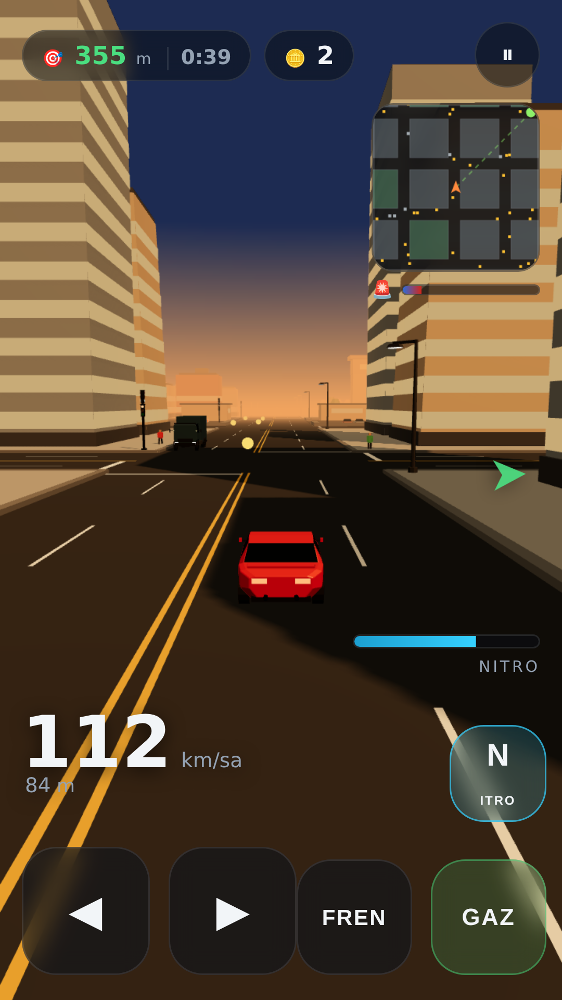
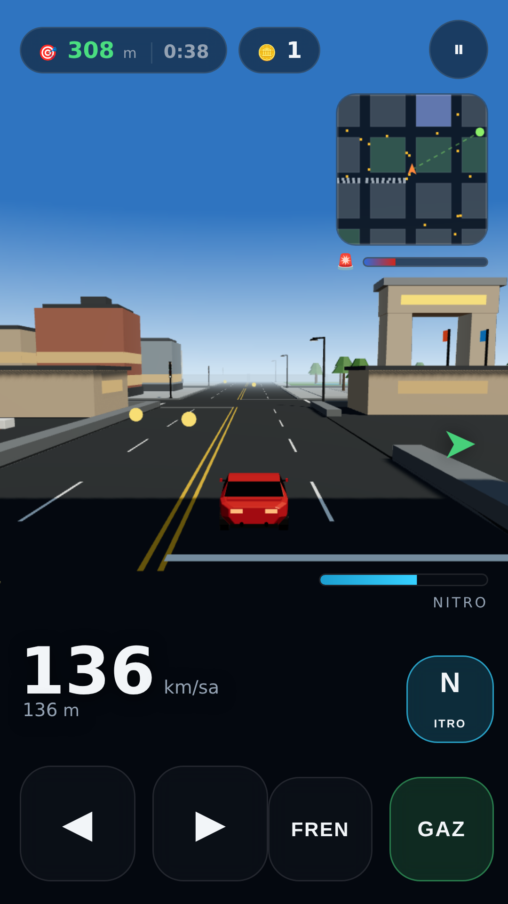
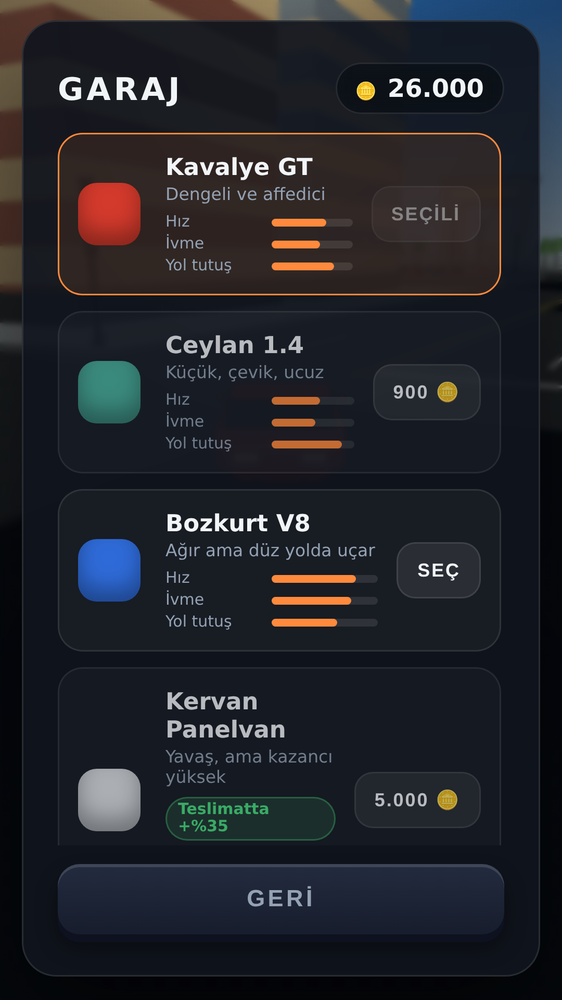

# Dörtyol

Telefon için 3B sürüş oyunu. **Bütün 3B modeller Blender ile, kod içinden
üretiliyor** — indirilen hazır model yok, elle modellenen mesh yok.
`blender/` klasöründeki Python betikleri arabaları, şehri, yolu ve nesneleri
kurar ve `.glb` olarak dışa aktarır; oyun bunları yükler.

Türkçe ve İngilizce. Reklam yok, uygulama içi satın alma yok, internet
gerektirmez.



| Mod | Ne yapıyorsun |
|---|---|
| **Serbest Sürüş** | 626 metrelik, 64 adalık ızgara sokaklı bir şehirde istediğin gibi gez. Çalışan trafik ışıkları, kırmızıda kuyruğa giren ve kavşakta dönen trafik, kaldırımlarda yürüyen insanlar, girilebilen otoparklar. Yönünü **kule**, **stadyum** ve **meydan**dan bulursun. Jeton topla; **teslimat**, **yolcu** ve **kurye** işlerini süreye karşı yetiştir. Ama dikkat: çarpmak arabayı **hasarlar**, pervasız sürmek **polisi** çağırır. |
| **Trafik Yarışı** | Sonsuz otoyolda trafiği yararak skor topla. Hızlı gitmek ve sıyırarak geçmek ekstra puan. |

Kazandığın jetonlarla garajdan **beş arabadan** birini alır, **motor /
şanzıman / lastik / fren** takar ve **rengini** değiştirirsin. Arabalar sadece
hızla ayrışmıyor: panelvan her yarışı kaybeder ama teslimatta **%35 fazla**
kazandırır. Her araç kendi donanımını ve rengini hatırlar.

Ayarlardan **gündüz / akşam / gece** seçebilir ya da her tura rastgele
bırakabilirsin. Gecede binaların camları ve sokak lambaları yanar, arabanın
farları yolu aydınlatır.




## Oynamak için

```bash
python3 tools/serve.py
```

Telefonun ve bilgisayarın aynı Wi-Fi ağındayken, betiğin yazdırdığı
`http://<ip>:8000` adresini telefonun tarayıcısında aç. "Ana ekrana ekle"
dersen tam ekran, çevrimdışı çalışan bir uygulama gibi açılır.

Bilgisayarda denemek için `http://localhost:8000` yeterli.

**Dikey de yatay da oynanır.** Telefonu çevirdiğinde arayüz yeniden diziliyor:
menü iki sütuna geçiyor, garaj kartları yan yana geliyor, kumandalar alt
köşelere yerleşiyor, kamera biraz yaklaşıyor.

### Kontroller

| | Dokunmatik | Klavye | Oyun kolu |
|---|---|---|---|
| Direksiyon | ◀ ▶ ya da ekranı kaydır | ← → / A D | sol çubuk |
| Gaz | GAZ | ↑ / W | RT ya da A |
| Fren / geri | FREN (dururken basılı tut) | Boşluk / ↓ | LT ya da B |
| Nitro | N | Shift | X ya da RB |

Ayarlardan dil, ses, müzik, titreşim, otomatik gaz, eğerek sürme (jiroskop),
gölgeler ve **solak düzeni** ayarlanabilir. Mini haritaya dokununca yakın
görünüm ile bütün şehir arasında geçiş yapar.

## Google Play

`android/` klasöründe, oyunu APK'nın içine gömen hazır bir Capacitor projesi
var; `store/` klasöründe de ikonlar, öne çıkan görsel, ekran görüntüleri,
iki dilde mağaza metni, gizlilik politikası ve Veri Güvenliği formu cevapları.

**Ama `.aab` henüz hiç derlenmedi ve oyun gerçek bir telefonda hiç
çalıştırılmadı.** Bu depo, `dl.google.com`'a erişemeyen bir ortamda
geliştirildi; Android SDK kurulamadı. Yayına çıkmadan önce yapılacakları ve
tüm derleme/imzalama adımlarını **[docs/RELEASE.md](docs/RELEASE.md)**
anlatıyor.

```bash
npm run android:sync      # oyunu Android projesine kopyala
npm run android:debug     # test APK'sı
npm run android:release   # imzalı .aab (önce keystore.properties gerekir)
```

## Depo düzeni

```
blender/           3B varlık üretimi (Blender'ın bpy modülü)
  lib/kit.py       düşük poligonlu modelleme araçları: kesit loft'u, materyal, GLB
  lib/vehicles.py  5 oynanabilir araba + 6 trafik aracı (polis dahil)
  lib/city.py      şehir: sokak ağı, bina adaları, simge yapılar,
                   trafik lambası, yaya, otopark
  lib/road.py      otoyol döşemeleri, bariyer, korkuluk
  lib/props.py     palmiye, kaktüs, kaya, lamba, pano, jeton, nitro
  build_all.py     hepsini üretir, ölçer, manifest.json yazar
  make_store.py    ikonlar, menü logosu ve mağaza görselleri
game/              oyunun kendisi (statik site, derleme adımı yok)
  js/              fizik, şehir, trafik, sinyaller, yayalar, polis, kademe,
                   garaj, girdi,
                   ses, kalite gözcüsü, i18n, arayüz
  assets/models/   üretilen .glb dosyaları + manifest.json
  vendor/three/    three.js (r180, MIT)
android/           Capacitor Android projesi
store/             Play için ikon, görsel, ekran görüntüsü ve metinler
tools/             yerel sunucu, çevrimdışı önbellek, Android ikonları,
                   mağaza ekran görüntüleri
tests/             gerçek tarayıcıda çalışan oyun testleri
docs/RELEASE.md    Play'e çıkarma rehberi
```

## Varlıkları yeniden üretmek

```bash
pip install bpy                      # Blender'ın Python modülü (Python 3.11)
npm run assets                       # tüm .glb dosyaları + manifest.json
npm run assets:preview               # üstelik her modelin önizleme render'ı
npm run store                        # ikonlar + öne çıkan görsel
npm run android:icons                # Android ikon setleri
npm run sw                           # çevrimdışı önbellek listesini güncelle
```

`build_all.py` her modeli **boş bir sahnede** kurar, üçgen sayısını ve gerçek
sınırlayıcı kutusunu ölçer ve bunları `manifest.json`'a yazar. Oyun çarpışma
boyutlarını, şerit konumlarını, şehir ızgarasını ve ada çarpışma şekillerini bu
dosyadan okur — yani oynanış her zaman gerçekten üretilmiş geometriyle aynı
sayıları kullanır, kodda ikinci bir kopya tutulmaz.

Toplam: 34 model, ~34.000 üçgen, ~3,2 MB paket.

## Test

```bash
npm install
npm test
```

Testler oyunu gerçek bir tarayıcıda (headless Chromium) açar. Dört paket:

- **city** — şehrin kurulması; direksiyonun doğru yöne dönmesi; ışık fazları;
  3 dakikalık simülasyonda hiçbir trafik aracının adaya girmemesi, kırmızıda
  kuyruk ve kavşakta dönüş; kaldırım/duvar çarpışması; otoparka girilebilmesi
  ama içindeki engellerin durdurması; yayaların kaldırımdan inmemesi; garajda
  parça ve renk; teslimat süresinin sokak mesafesine göre hesaplanması; oyun
  kolu; geri vites kamerası; hedef oku; mini harita yakınlaşması; üç simge
  yapının hep aynı adada durması ve mini haritada ayrı renkte görünmesi;
  hasarın hızı düşürüp garajda para karşılığı geçmesi; hız yapınca devriyenin
  yola çıkması, yaklaşması, yakalayınca ceza kesmesi ve ekilebilmesi;
  çırağa sadece basit teslimat verilmesi, üst kademede üç işin de çıkması,
  kademenin ücreti yükseltmesi ve terfinin duyurulması.
- **highway** — skor, sollama ve kıl payı bonusları, satın alma, duraklatma,
  12 km sonrası koordinat sıfırlama.
- **layout** — altı ekran boyutunda (küçük telefon → tablet, iki yön) her
  ekranın sığması, kumandaların ekranda kalması ve göstergelerle çakışmaması.
- **shell** — cihaz diline göre dil seçimi ve dil değiştirme; kalite
  gözcüsünün yavaş cihazda kademe düşürüp hızlı cihazda dokunmaması; ilk
  kullanım rehberi; ayarların kaydedilip yeniden açılışta geri gelmesi;
  garajdaki beş araba ve kazanç rozetinin görünmesi.

## Nasıl çalışıyor (kısa notlar)

**Arabalar tek bir loft'tan çıkıyor.** `kit.loft()` bir dizi kesiti köprüleyip
gövdeyi oluşturur. Kesitte "bel hattı" ayrı bir nokta olduğu için iki kesit
arasındaki her dörtgen bandın ne olduğu bellidir: yan panel, cam bandı, tavan.
Camlar bu yüzden ek geometri olmadan, sadece o bantlara cam materyali atanarak
oluşur — ön cam da kaput ile kabin kesiti arasındaki tavan bandından
kendiliğinden çıkar.

**Şehir tek mesh.** Asfalt ve bütün yol çizgileri tek bir mesh olarak üretilir,
yani harita ne kadar büyürse büyüsün yollar üç çizim çağrısı tutar.

**Adaların çarpışma şekli Blender'dan geliyor.** Sıradan adalar tek kutu;
otopark ise engellerini tek tek bildirir. Aynı liste hem meshleri yerleştirir
hem oyuna çarpışma olarak gider.

**Bütün şehrin ışıkları altı materyalle yönetiliyor.** Her kavşaktaki direk
aynı altı lamba materyalini paylaşır, yani faz değişimi 49 direği dolaşmak
yerine altı `emissiveIntensity` yazmasıdır.

**Trafik dönüşleri gerçek yay çiziyor.** Yayın sonu her zaman karşı sokağın
geçerli bir şeridine denk gelir; bu yüzden binalara girmeleri için ayrıca
çarpışma testi gerekmez.

**Gölgeler dar bir kutuyla çalışıyor.** Gölge kamerası arabayı takip eden
124 m'lik bir kutu, yani 1024 piksel gerçekten bulunduğun sokağa düşer.
Maliyeti ~25 çizim çağrısı.

**Menü CSS metni değil, üretilmiş bir tabela.** Ana menünün logosu
Blender'da modellenip saydam arka planla render edilen bir yol tabelası:
turuncu çerçeve, lacivert yüzey, kabartma harfler, iki direk. Önce tabelayı
bir dörtyolun üstüne koymuştum — 300 piksele küçülünce yollar "kenarından
kesilmiş gri bir levha" gibi okundu, direkli tabela ise her boyutta okunuyor.
Menüdeki düğmeler de düz dikdörtgen değil: her birinin ön yüzünün altında
sert bir gölge — bir "dudak" — var ve basınca düğme aşağı inip dudak
kısalıyor, yani basılacak bir kalınlığı oluyor. Aynı davranış oyunun bütün
düğmelerinde geçerli.

**Yol çizgileri kutu değil, düz dörtgen.** Asfalta boyanan her şerit, durak
çizgisi ve orta çizgi iki üçgen; kutu olsaydı on iki olurdu. 626 metrelik
şehirde fark 20.844 üçgenden 3.468'e iniyor ve bütün yol ağı tek çizim
çağrısı grubunda kalıyor. Sürerken ölçülen toplam: **~270-360 çizim çağrısı,
~35.000 üçgen**.

**Kazandığın tek şey para değil: bir de kariyer.** Para eline geçtiği anda
harcanıyor — araba, parça, onarım — yani ne yaptığının kötü bir kaydı. Kademe
iyi bir kaydı: sadece yükseliyor, şehrin sana hangi işleri vereceğini
belirliyor ve her ücretin ödendiği oranı yükseltiyor. Sekiz kademe var;
**yolcu** işleri 2., **kurye** işleri 4. kademede açılıyor, en üstte ücretler
**%40** daha yüksek. Deneyim iş başına, zamanında varınca, **çizik almadan
bitirince** ve sürülen kilometre başına geliyor. Arabalar hâlâ sadece parayla
alınıyor: aynı satın almayı iki para birimiyle kilitlemek bir fazlası olurdu.

**KAYITLAR ekranı** ömür boyu toplamları tutuyor: bitirilen iş, zamanında
varılan, çiziksiz tamamlanan, sürülen yol, kazanılan jeton, çarpışma,
yakalanma, ekme ve en iyi skor — artı kademe merdiveni.

**Çarpmanın bir bedeli var.** Her çarpışma arabaya hasar yazar, hasar da azami
hızı düşürür — tam hasarlı bir araba hızının **%35'ini** kaybeder. Hasar
oturumlar arası kalıcıdır; tek çıkış yolu garajda **onarım** parasını
ödemektir. Kaldırıma sürtmek hasar sayılmaz: 5,5 m/s altındaki temaslar
yok sayılır, yoksa park etmek ceza olurdu.

**Pervasız sürersen polis gelir.** Trafiğe çarpmak, binaya toslamak ve hız
sınırının üstünde gitmek "arananlık" göstergesini doldurur; dolduğunda bir
devriye arabası yola çıkar. Devriye serbestçe peşine takılmaz, **sokak
ızgarasını** sürer: her kavşakta sana en uzak olduğu eksene döner. Bu hem
her zaman yaklaşmasını sağlar hem de bir binanın içinden geçmesini imkânsız
kılar. Yakalanırsan kazancının **dörtte biri** ceza; ektiğinde bedava.

**Üç simge yapı sabit adalarda.** Kule (87 m), stadyum ve meydan her oyunda
aynı yerde duruyor ve mini haritada ayrı renkte görünüyor: birbirinin aynı
adalardan oluşan bir ızgarada yönünü bulabilmen için.

**Oyun kendi akıcılığını izliyor.** Kare süresi sürekli yüksek kalırsa görüntü
ayarlarını kendiliğinden düşürür (gölge, yaya sayısı, görüş mesafesi, piksel
oranı) ve seçtiği kademeyi hatırlar. Kendiliğinden **yükseltmez** — iki kötü
durum arasında gidip gelen bir oyun, tek bir kötü durumdan daha kötüdür.

**Yayalar iskeletsiz yürüyor.** Modelde sadece bacaklar ayrı nesne ve pivotları
kalçada; oyun bacakları doğrudan sallar. Kaldırımda yürüdükleri için — arabanın
giremediği alan — çarpışma kontrolü de gerekmez.

**Farlar ışık değil, geometri.** Araç başına gölge düşüren gerçek bir spot
ışığı yerine iki ince koni ve asfalta düşen yumuşak bir ışık havuzu var;
kameranın durduğu mesafeden aynı okunuyor, maliyeti ise neredeyse sıfır.

**Ses dosyası yok.** Motor sesi iki detune saw osilatör + alçak geçiren
filtreden gürültü, lastik cızırtısı bant geçiren filtreli gürültü, müzik ise
ses saatine karşı çalınan dört ölçülük bir döngü — hepsi Web Audio ile
sentezleniyor.

## Lisans

three.js MIT lisanslıdır (`game/vendor/three/LICENSE`). Geri kalan kod ve
üretilen varlıklar bu depoya aittir.
