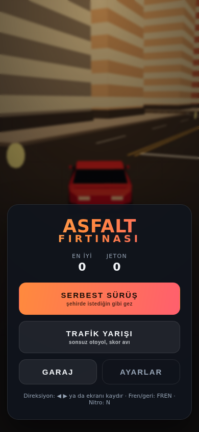
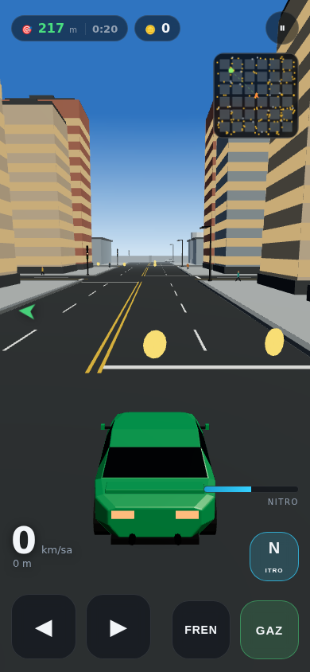
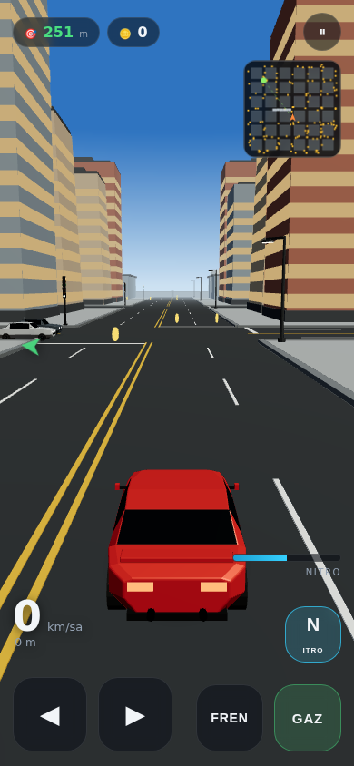
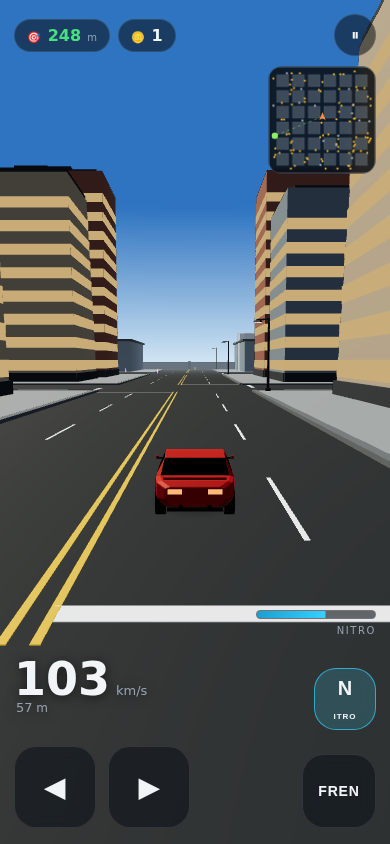
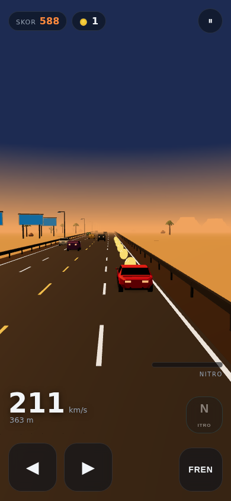
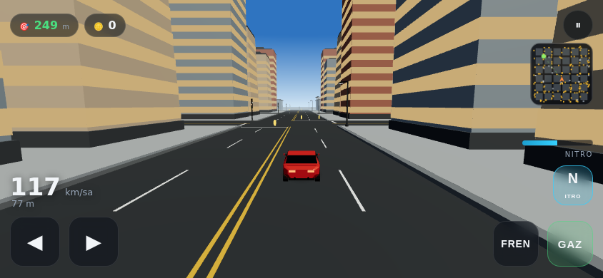
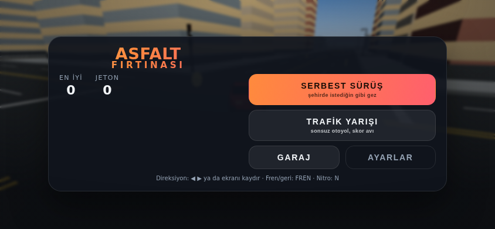

# Asfalt Fırtınası

Telefon için 3B araba oyunu. **Bütün 3B modeller Blender ile, kod içinden
üretiliyor** — indirilen hazır model yok, elle modellenen mesh yok. `blender/`
klasöründeki Python betikleri arabaları, şehri, yolu ve nesneleri kurar ve
`.glb` olarak dışa aktarır; oyun bunları yükler.

İki mod var:

| Mod | Ne yapıyorsun |
|---|---|
| **Serbest Sürüş** | Izgara düzenli bir şehirde istediğin gibi gez. Trafik ışıklı kavşaklar, kırmızıda kuyruğa giren ve dönüş yapan trafik. Jeton topla, teslimat görevlerini tamamla; hedef ekran dışındayken kenarda bir ok yön gösterir. |
| **Trafik Yarışı** | Sonsuz otoyolda trafiği yararak skor topla. Sıyırarak geçmek ekstra puan. |

Kazandığın jetonlarla garajdan yeni araba açarsın; ilerleme telefonda kayıtlı
kalır.







## Oynamak için

```bash
python3 tools/serve.py
```

Sonra telefonun ve bilgisayarın aynı Wi-Fi ağındayken, betiğin yazdırdığı
`http://<ip>:8000` adresini telefonun tarayıcısında aç. Tarayıcı menüsünden
"Ana ekrana ekle" dersen tam ekran, çevrimdışı çalışan bir uygulama gibi açılır
(PWA; tüm dosyalar önbelleğe alınır).

Bilgisayarda denemek için `http://localhost:8000` yeterli.

**Dikey de yatay da oynanır.** Telefonu çevirdiğinde arayüz kendini yeniden
diziyor: yatayda menü iki sütuna geçiyor, garaj kartları yan yana geliyor,
kumandalar alt köşelere yerleşiyor ve kamera biraz yaklaşıp görüş açısını
daraltıyor — kısa ekranda araba küçük kalmasın diye. Zorunlu bir yön yok,
istediğin gibi tut.




### Kontroller

| | Dokunmatik | Klavye |
|---|---|---|
| Direksiyon | ◀ ▶ tuşları, ya da ekranı parmakla sağa/sola kaydır | ← → veya A/D |
| Gaz | GAZ | ↑ veya W |
| Fren / geri vites | FREN (dururken basılı tutarsan geri gider; kamera öne döner) | Boşluk veya ↓ |
| Nitro | N | Shift |
| Duraklat | ⏸ | — |

Ayarlardan **otomatik gaz** (gaz pedalı olmadan sürekli hızlanma) ve
**eğerek sürme** (jiroskop) açılabilir.

## Depo düzeni

```
blender/           3B varlık üretimi (Blender'ın bpy modülü)
  lib/kit.py       düşük poligonlu modelleme araçları: kesit loft'u, materyal, GLB dışa aktarma
  lib/vehicles.py  3 oynanabilir araba + 5 trafik aracı
  lib/city.py      şehir: sokak ağı, bina adaları, trafik lambası
  lib/road.py      otoyol döşemeleri, bariyer, korkuluk
  lib/props.py     palmiye, kaktüs, kaya, lamba, pano, jeton, nitro
  build_all.py     hepsini üretir, ölçer, manifest.json yazar
  make_icons.py    uygulama ikonlarını süper arabadan render eder
game/              oyunun kendisi (statik site, derleme adımı yok)
  js/              modüller: fizik, şehir, trafik, girdi, ses, arayüz
  assets/models/   üretilen .glb dosyaları + manifest.json
  vendor/three/    three.js (r180, MIT)
tools/serve.py     yerel sunucu (telefondan bağlanmak için)
tools/make_sw.py   çevrimdışı önbellek listesini yeniden üretir
tests/             gerçek tarayıcıda çalışan oyun testleri
docs/previews/     her modelin Blender render'ı (contact_sheet.png hepsi bir arada)
docs/screens/      oyundan ekran görüntüleri
```

## Varlıkları yeniden üretmek

```bash
pip install bpy                      # Blender'ın Python modülü (Python 3.11)
npm run assets                       # tüm .glb dosyaları + manifest.json
npm run assets:preview               # üstelik her modelin önizleme render'ı
npm run icons                        # uygulama ikonları
npm run sw                           # çevrimdışı önbellek listesini güncelle
```

`build_all.py` her modeli **boş bir sahnede** kurar, üçgen sayısını ve gerçek
sınırlayıcı kutusunu ölçer ve bunları `manifest.json`'a yazar. Oyun çarpışma
boyutlarını, şerit konumlarını ve şehir ızgarasını bu dosyadan okur — yani
oynanış her zaman gerçekten üretilmiş geometriyle aynı sayıları kullanır, kodda
ikinci bir kopya tutulmaz.

Toplam: 30 model, ~28.000 üçgen, ~2,9 MB.

## Test

```bash
npm install
npm test
```

Testler oyunu gerçek bir tarayıcıda (headless Chromium) açar. Doğrulananlar:
varlıkların yüklenmesi; şehrin kurulması; **sağa basınca arabanın sağa gitmesi
ve ön tekerleklerin o yöne bakması**; ışık fazlarının dönmesi ve iki eksenin
asla aynı anda yeşil olmaması; 3 dakikalık simülasyonda hiçbir trafik aracının
adaya girmemesi, kırmızıda kuyruk oluşması ve dönüş yapması; geri viteste
kameranın öne dönmesi; hedef okunun sadece hedef ekran dışındayken çıkması ve
doğru yönü göstermesi; kaldırım/duvar çarpışması; jeton ve teslimat döngüsünün
ödeme yapması; kazancın profile yazılması; otoyol modunda skor, sollama ve
kıl payı bonusları ile 12 km sonrası koordinat sıfırlama; ve çizim çağrısı
sayısının telefon için makul kalması.

Ayrı bir düzen testi (`tests/layout.test.mjs`) altı ekran boyutunda — küçük
telefon, telefon dikey, telefon yatay, büyük telefon yatay, tablet dikey,
tablet yatay — her ekranın taşmadan sığdığını, kumanda tuşlarının ekran içinde
kaldığını ve gösterge alanlarıyla çakışmadığını doğruluyor.

## Nasıl çalışıyor (kısa notlar)

**Arabalar tek bir loft'tan çıkıyor.** `kit.loft()` bir dizi kesiti köprüleyip
gövdeyi oluşturur. Kesitte "bel hattı" (`zb`) ayrı bir nokta olduğu için, iki
kesit arasındaki her dörtgen bandın ne olduğu bellidir: yan panel, cam bandı,
tavan. Camlar bu yüzden ek geometri olmadan, sadece o bantlara cam materyali
atanarak oluşur — ön cam da kaput kesitiyle kabin kesiti arasındaki tavan
bandından kendiliğinden çıkar.

**Şehir tek mesh.** Asfalt ve bütün yol çizgileri tek bir mesh olarak üretilir,
yani harita ne kadar büyürse büyüsün yollar üç çizim çağrısı tutar. Adalar da
kendi içlerinde birleştirilmiştir.

**Metaller için ortam haritası şart.** Sahnedeki gökyüzü, bir canvas gradyanı
olarak üretilip PMREM'den geçiriliyor ve hem arka plan hem ortam haritası
olarak kullanılıyor; olmasaydı metalik materyaller simsiyah görünürdü.

**Bütün şehrin ışıkları altı materyalle yönetiliyor.** Her kavşaktaki direk
aynı altı lamba materyalini paylaşıyor (eksen başına kırmızı/sarı/yeşil), yani
faz değişimi 49 direği tek tek dolaşmak yerine altı `emissiveIntensity`
yazması. Aynı şey oyuncu için de iyi: gördüğün ışık, yandan gelen trafiğin
uyduğu ışıkla aynı.

**Trafik dönüşleri gerçek yaya çiziliyor.** Bir araç kavşakta dönerken çeyrek
daire bir yay boyunca ilerliyor ve yayın sonu her zaman karşı sokağın geçerli
bir şeridine denk geliyor — bu yüzden binalara girmeleri için ayrıca çarpışma
testi gerekmiyor. Testte 3 dakikalık simülasyonda 22 aracın hiçbiri adaya
girmiyor.

**Ses dosyası yok.** Motor sesi iki detune saw osilatör + gürültünün alçak
geçiren filtreden geçmesiyle, lastik cızırtısı bant geçiren filtreli gürültüyle,
diğer efektler kısa zarflarla Web Audio'da sentezleniyor.

## Lisans

three.js MIT lisanslıdır (`game/vendor/three/LICENSE`). Geri kalan kod ve
üretilen varlıklar bu depoya aittir.
