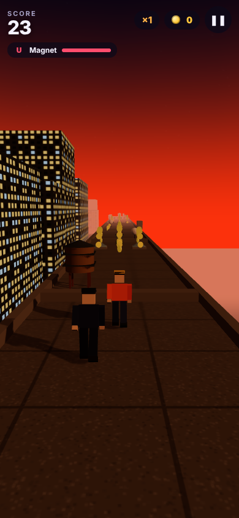

# Sıçra

Telefon için 3B sonsuz koşu oyunu. İstanbul çatılarında, günbatımından
geceye, bir bekçiden kaçarak koşuyorsun: **kaydırarak şerit değiştir, yukarı
kaydırıp zıpla, aşağı kaydırıp kay**, bacalardan ve çamaşır iplerinden
kurtul, çatılar arasındaki boşlukları atla, altın topla.

Türkçe ve İngilizce. Reklam yok, satın alma yok, internet gerektirmez. Bütün
3B geometri koddan üretiliyor, bütün sesler Web Audio ile sentezleniyor:
indirilen tek bir model ya da ses dosyası yok.



## Oyun

| | |
|---|---|
| **Koşu** | Üç şerit, hız mesafeyle 10 m/sn'den 22 m/sn'ye çıkar. Çatılar rastgele uzunlukta, aralarında 2,4–5,2 m boşluklar var; boşluğa zıplamadan girersen düşersin, geç zıplarsan karşı cepheye çarparsın. Kenardan çıktıktan sonra 0,12 sn "coyote" payı var. |
| **Engeller** | Baca, su deposu, çanak anten, billboard (iki şerit): şerit değiştir. Klima, havalandırma, çatı penceresi: zıpla. Çamaşır ipi (üç şerit): kay. Her engel satırı **kesinlikle geçilebilir** üretilir; testler bunu doğruluyor. |
| **Altın** | Şerit boyunca sıralar, alçak engellerin üstünde zıplama yayı, boşlukların üstünde kemer: altınlar aynı zamanda doğru hamleyi gösterir. |
| **Güçlendirmeler** | **Mıknatıs** altınları çeker, **Kalkan** engelleri parçalar, **Kanat** çatıların üstünden uçurur (ve iniş için altında çatı olmasını bekler). Dükkandan beş seviyeye kadar süreleri uzatılır. |
| **Kıl payı** | Bir engelden son anda şerit değiştirerek, tam üstünden zıplayarak ya da tam altından kayarak geçmek sayılır; görevlere işler. |
| **Bekçi** | Arkandan koşar, senin birkaç saniye önceki yolunu aynen tekrarlar (sen zıpladıysan o da zıplar). Çarpınca seni yakalar; gece el fenerinin konisi görünür. |
| **Görevler** | Aynı anda üç görev (tek koşuda N altın, N zıplama, N boşluk, toplam mesafe…). Üçü de bitince **skor çarpanı** 0,5 artar (en fazla ×5) ve yeni üçlü gelir. |
| **Dükkan** | Altı karakter (Ekin, Deniz, R‑7, Gölge, Astro, Sultan) ve üç güçlendirme yükseltmesi. |
| **Devam** | Ölünce koşu başına bir kez 60 altına kaldığın yerden devam edersin; önündeki 30 m engelden temizlenir, kısa bir kalkan verilir. |
| **Gün döngüsü** | Her 1800 m'de günbatımı → gece → şafak → gündüz → günbatımı. Gece pencereler yanar, yıldızlar çıkar, karşı kıyıdaki siluetin ışıkları görünür. |

Skor = (mesafe + 5 × altın) × çarpan.

## Oynamak için

```bash
cd sicra
python3 tools/serve.py
```

Telefonun ve bilgisayarın aynı Wi‑Fi'deyken betiğin yazdırdığı
`http://<ip>:8000` adresini telefonun tarayıcısında aç; "Ana ekrana ekle"
dersen tam ekran ve çevrimdışı çalışır. Bilgisayarda `http://localhost:8000`
yeterli: ok tuşları / WASD / boşluk ile oynanır, Esc duraklatır.

## Nasıl kurulu

```
index.html            tek sayfa; HUD ve menüler DOM
css/style.css         koyu lacivert + günbatımı turuncusu, dikey/yatay düzen
js/
  main.js             durum makinesi (menü → hazır → koşu → duraklat/ölüm → bitti),
                      sabit adımlı simülasyon (120 Hz), test kancası window.__sicra
  config.js           bütün ayar sabitleri: şeritler, hızlar, engeller, fiyatlar
  world.js            renderer, kamera, gökyüzü kubbesi (shader), yıldızlar, ay/güneş,
                      deniz, uzak silüet (cami, köprü, kuleler), gün döngüsü,
                      pencere dokuları (canvas)
  track.js            çatı üretimi, çözülebilir engel satırları, altın desenleri,
                      güçlendirmeler, dekor binalar, çarpışma, geri dönüşüm havuzları
  player.js           şerit, zıplama, kayma, yerçekimi, uçuş, kalkan, kıl payı verisi
  figure.js           kutulardan insan modeli + koşu/zıplama/kayma/düşme pozları
  chaser.js           bekçi: oyuncunun geçmiş yolunu tekrar eder
  effects.js          tek Points sistemiyle parçacıklar
  audio.js            sentezlenmiş sesler ve iki sesli müzik döngüsü
  missions.js         kademeli görev şablonları, çarpan
  ui.js, hud.js       ekranlar ve koşu içi gösterge
  input.js            kaydırma hareketleri + klavye, kuyruklu eylemler
  save.js, i18n.js, haptics.js, quality.js (kare süresine göre kalite düşürme)
tools/                yerel sunucu, servis çalışanı üretici, ikonlar (Pillow),
                      dist/ toplayıcı
tests/                gerçek Chromium'da çalışan üç paket
android/              Capacitor Android projesi (dist/ klasörünü paketler)
```

### Tasarım notları

**Simülasyon ve çizim ayrı.** Fizik 120 Hz sabit adımla ilerler; çizim ne
hızda olursa olsun sonuç aynı. Testler bu yüzden gerçek zaman yerine
`__sicra.step(dt, n)` ile koşuyu elle ilerletir ve yavaş bir sanal GPU'da
bile aynı sonucu alır.

**Her satır geçilebilir.** Engel satırları beş kalıptan seçilir (tek, alçak,
ip, çift, karma). Çift ve karma kalıplarda boş şerit, bir önceki satırın boş
şeritlerinden en fazla bir şerit uzakta seçilir; iki şerit uzaksa satır
geriye itilir. Boşluktan sonra 5,5 m, boşluktan önce 3 m engel konmaz.

**Çarpışma tek kural.** Oyuncunun kutusu (ayakta 1,8 m, kayarken 0,85 m) ile
engelin dikey dilimi (`bottom`–`top`) kesişiyorsa çarpma. Alçak engelin
üstünden zıplamak, ipin altından kaymak ve her ikisinin yanlış yapılması bu
tek kuraldan çıkar; engel başına özel kod yok.

**Kamera +z'ye bakar, bu yüzden +x ekranın solu.** Şerit 0 ekranın solunda
olsun diye `LANES = [2.2, 0, -2.2]`; bu bir kez `config.js`'te duruyor.

**Bütün cepheler tek dokudan.** Üç canvas pencere dokusu, kutu
geometrisinin UV'leri bina boyutuna göre ölçeklenerek tekrarlanır; gece
`emissiveIntensity` yükselince pencereler yanar. Bina başına materyal
kopyası yok.

## Test

```bash
npm install
npm test
```

- **game** — tohumlu üretimin tekrarlanabilirliği; 2,5 km'lik üretimde her
  satırın geçilebilir olması; iniş bölgesinde engel olmaması; hiçbir şey
  yapmayınca koşunun bitmesi; şerit değişimi ve kenar sınırı; zıplama ve
  kayma kutuları; altın toplama; bacaya çarpma / kalkanla parçalama;
  klimanın üstünden zıplama; ipin altından kayma (ayakta kalınca çarpma);
  boşluğa düşme / zıplayarak geçme; mıknatısın yan şeritten çekmesi; kanadın
  uçurup indirmesi; hız rampası; ölüm ekranı ve 60 altınlık devam; kıl payı;
  duraklat/devam/çık; gerçek kaydırma hareketiyle zıplama.
- **shell** — cihaz diline göre dil; ayarların yeniden yüklemede kalması;
  dükkanda yetersiz altın, satın alma, seçim, yükseltme; üç aktif görev;
  görev tamamlama bildirimi ve ödemesi; yeni üçlü ve çarpan; bitiş ekranı
  sayıları; ilerlemeyi sıfırlama.
- **layout** — altı ekran boyutunda altı ekranın sığması, düğmelerin ≥ 36 px
  ve görünür olması, HUD'un çakışmaması.

## Android

`android/` içinde hazır bir Capacitor projesi var; `npm run android:sync`
önce `dist/` klasörünü toplar (`index.html`, `css`, `js`, `assets`,
`vendor`, manifest, servis çalışanı) sonra Android projesine kopyalar.

**APK henüz derlenmedi ve oyun gerçek telefonda hiç çalıştırılmadı.** Bu
depo Android SDK'nın kurulamadığı, yazılım OpenGL ile ~4 fps çizen bir
ortamda geliştirildi. Yayına çıkmadan önce:

1. `python3 tools/serve.py` ile telefonda tarayıcıdan oyna. Takılırsa kalite
   gözcüsü kendi kendine orta/düşüğe iner; oynanabilir mi not et.
2. Android Studio ile `npm run android:debug`, APK'yı kur, WebView'da hızı,
   tam ekranı, dönmeyi ve titreşimi dene.
3. `npm run android:release` için `android/keystore.properties` gerekir;
   adımlar Dörtyol'un `docs/RELEASE.md` dosyasındakiyle aynı.

Uygulama kimliği `com.sicra.runner`, sürüm `0.1.0`. Mağaza ikonları
`store/` klasöründe (`npm run icons` yeniden üretir).
